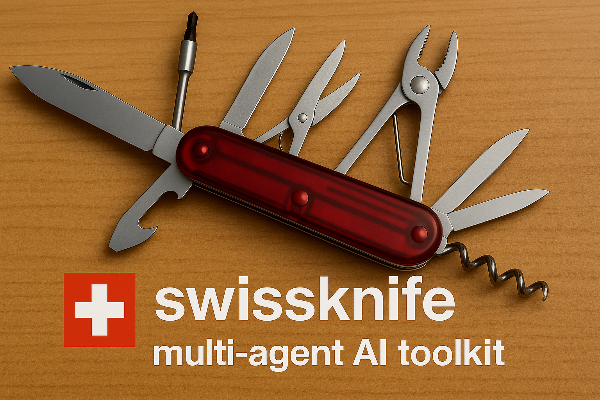

# SwissKnife Web Desktop

<div align="center">
  
</div>

A browser-based desktop environment for SwissKnife, featuring a complete desktop UI with windowing system, terminal, AI chat, and more.

## 🚀 Features

- **Complete Desktop Environment**: CDE-inspired desktop with taskbar, windows, and applications
- **SwissKnife Terminal**: Interactive terminal with SwissKnife commands
- **AI Chat**: Direct chat interface with AI models
- **Settings Management**: Configure API keys and system settings
- **Content-Addressed Storage**: Browser-based content storage
- **Real-time System Status**: Live system monitoring and status updates

## 🏗️ Build Process

### Prerequisites

- Node.js 18+ and npm
- Modern browser with ES6+ support

### Building

```bash
# Navigate to web directory
cd web

# Install dependencies
npm install

# Build for development
npm run build:dev

# Build for production
npm run build

# Serve locally
npm run serve

# Development server with hot reload
npm run dev
```

### Build Outputs

- `dist/bundle.js` - Main application bundle
- `dist/index.html` - Desktop environment HTML
- `dist/css/` - Stylesheets
- Additional chunks for dynamic imports

## 🖥️ Desktop Applications

### Terminal App
- Full SwissKnife command support
- Command history and tab completion
- Real AI integration when API keys are configured
- Commands: `help`, `chat`, `agent`, `task`, `config`, `models`, `storage`

### AI Chat App
- Direct chat interface with AI models
- Real-time message streaming
- Conversation history
- Error handling and status indicators

### Settings App
- API key management
- Configuration viewing and editing
- Model listing and status
- Storage settings

### Planned Applications
- **VibeCode**: WebNN/WebGPU powered code editor
- **File Manager**: Content-addressed file management
- **Model Browser**: AI model management and selection

## 🔧 Configuration

### API Keys

API keys can be configured in several ways:

1. **Settings App**: Use the desktop settings application
2. **localStorage**: Store directly in browser storage
3. **Environment**: Set during initialization

```javascript
// Example configuration
localStorage.setItem('swissknife_openai_key', 'sk-your-key-here');
```

### Storage

The web version uses browser-compatible storage:

- **Configuration**: localStorage
- **Content Storage**: localStorage with content-addressing
- **Future**: IndexedDB for larger datasets

## 🎨 Desktop Environment

### Window Management
- Draggable windows with title bars
- Minimize, maximize, and close controls
- Z-index management for window stacking
- Keyboard shortcuts (Ctrl+T for terminal, Ctrl+Shift+C for chat)

### Desktop Features
- System time display
- Status monitoring
- Application launcher
- Context menus
- Desktop icons

### Styling
- Dark theme inspired by VS Code
- CDE-style window decorations
- Responsive design
- CSS custom properties for theming

## 🔗 SwissKnife Integration

The web version includes a browser-adapted version of the SwissKnife core:

### Core Features
- AI model management
- Task execution and tracking
- Configuration management
- Content-addressed storage
- OpenAI API integration

### Browser Adaptations
- Node.js polyfills for crypto, buffer, process
- localStorage-based configuration
- Fetch-based API calls
- Web Workers for background tasks (planned)

### Limitations
- No file system access (uses browser storage)
- Limited to web-compatible AI providers
- No shell command execution
- Reduced performance vs. Node.js version

## 📦 Architecture

```
web/
├── index.html              # Desktop environment HTML
├── js/
│   ├── main-working.js     # Desktop manager
│   ├── swissknife-browser-clean.js  # Browser-adapted core
│   └── apps/               # Desktop applications
│       ├── terminal.js     # Terminal application
│       └── ...             # Other apps
├── css/                    # Stylesheets
│   ├── desktop.css         # Desktop environment
│   ├── windows.css         # Window management
│   ├── terminal.css        # Terminal styling
│   └── apps.css           # Application styles
├── webpack.working.config.js  # Build configuration
└── package.json           # Dependencies and scripts
```

## 🚀 Development

### Adding New Applications

1. Create app file in `js/apps/`
2. Register in desktop manager
3. Add corresponding styles
4. Update desktop icons and menu

### Building Features

The build process uses Webpack to:
- Bundle JavaScript modules
- Process CSS with PostCSS
- Inject styles into HTML
- Handle dynamic imports
- Optimize for production

### Browser Compatibility

- Modern browsers with ES6+ support
- WebGL for future WebNN/WebGPU features
- Local storage and IndexedDB support
- Fetch API for network requests

## 🔮 Future Enhancements

- **WebNN/WebGPU**: Local AI model execution
- **IPFS Integration**: Distributed content storage
- **PWA Support**: Offline functionality
- **Web Workers**: Background task processing
- **WebRTC**: Peer-to-peer communication
- **File System API**: Direct file access (where supported)

## 🐛 Troubleshooting

### Common Issues

1. **Build Failures**: Check Node.js version and dependencies
2. **API Errors**: Verify API keys in settings
3. **CORS Issues**: Use `--cors` flag with http-server
4. **Missing Features**: Some Node.js features unavailable in browser

### Debug Mode

Enable debug logging:
```javascript
localStorage.setItem('swissknife_debug', 'true');
```

### Performance

Monitor performance:
- Check bundle sizes with webpack-bundle-analyzer
- Use browser DevTools for runtime analysis
- Consider code splitting for large applications
